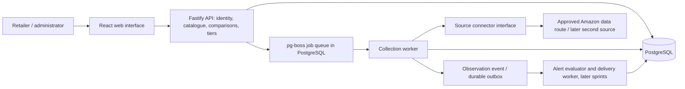

# Riven system baseline

**Version:** 0.1 — 28 September 2026. **Status:** Proposed technical baseline for team review; not evidence of implementation or client acceptance.

## 1. Whole-product goal

Deliver a multi-tenant application that helps retailers monitor selected competitor listings, understand price and availability changes, review history and receive alerts. Include tracking limits, configurable tiers and administrator oversight. Retailers make their own pricing decisions. The first sprint is an increment of this product, not a separate disposable application.

Read [requirements](../requirements.md), [collection strategy](collection-strategy.md), [quality targets](quality-targets.md), [decision records](decisions.md) and [team guide](../team-working-guide.md) together.

| Established by the user | Recommended here | Still unproven/open |
| --- | --- | --- |
| Four members, six sprints, TypeScript, Amazon first, no funded infrastructure; development on personal computers | Amazon UK, wired USB mice, manual listing URLs, one modular backend with a separate worker, PostgreSQL | Amazon access/retention rights, live source reliability, delivery context, team skills/capacity, named owners, final hosting |
| Full retailer product, maintainability, scalability and documented decisions matter | Stable ownership areas with backup reviewers and integrated sprint outcomes | Client acceptance of numerical limits, featured-offer versus named-seller monitoring, tier-management actor |

One source is sufficient for the Sprint 1 connector milestone. FR-03 and the submitted working scope still expect two platforms in the final product. A change to one final platform needs a recorded scope decision. Multiple sellers on Amazon do not constitute two platforms.

## 2. Firm rules and controlled flexibility

**Keep firm:** tenant isolation; price/variant/currency semantics; immutable observations; asynchronous collection; explicit failure/freshness; module interfaces; review and test evidence; no unrecorded scope changes.

**Change with evidence:** source transport, selectors, frameworks if a compatibility trial fails, hosting, polling intervals and later sprint task allocation. Record consequential changes in an ADR with impact and migration steps. A frozen selector or a promise of zero future changes would make the system brittle.

## 3. Architecture

Use a **modular monolith**: one repository and one domain model, with API and worker running as separate processes. This is not a microservice architecture. The worker can be restarted or moved without replacing the web application.

External sources are untrusted and may be unavailable. The dashboard reads stored observations; it never waits for a live scrape to render.

### Recommended stack

| Area | Baseline recommendation | Reason and constraint |
| --- | --- | --- |
| Runtime | TypeScript strict mode; Node.js 24 LTS; npm lockfile | One language for the team; pin a supported runtime and tested dependency versions during setup |
| Frontend | React + Vite, React Router, TanStack Query | Separate views, navigation and API state; no requirement for server-rendered dashboard pages |
| Styling | Tailwind CSS with shared design tokens; accessible reusable components | One visual system based on the agreed references; motion remains optional and respects reduced-motion preferences |
| Backend | Fastify modules with JSON Schema/TypeBox request and response contracts; OpenAPI | Explicit validation and reviewable HTTP contracts; avoid business logic inside route handlers |
| Data | PostgreSQL 17, node-postgres, Drizzle with reviewed SQL migrations | Same database in development, CI and deployment; relational integrity, history and durable jobs |
| Jobs | pg-boss, separate Node worker entry point | Durable jobs, retries and scheduling using the existing database; no Redis dependency initially |
| Identity | Better Auth with its documented Fastify/Drizzle integration | Use maintained session/authentication mechanisms; Riven must still enforce tenant membership and authorisation |
| Collection | Approved source API/feed where suitable; otherwise permitted HTTP + Cheerio, or plain Playwright only where rendering is needed | Source-specific transport is selected by evidence, not assumed to work on Amazon; no paid provider is a baseline dependency |
| Tests | Node test runner for backend/domain; React Testing Library for views; Playwright for the local application journey | Test realistic boundaries and critical behaviour; deterministic source fixtures in CI |
| Operations | Local Node processes plus PostgreSQL; reproducible container configuration after setup review | No paid infrastructure required for development; managed service/VPS choice deferred until resources exist |

These are recommendations to ratify in issue #4, not a claim the existing prototype already uses them. Confirm compatible stable versions, licenses and security advisories; do not select prereleases or copy arbitrary tutorial version pins.

### Modules and responsibility

| Module | Owns | Must not own |
| --- | --- | --- |
| Identity/workspaces | Sessions, membership, roles, tenant context | Scraping or product comparison |
| Catalogue | Retailer products, competitor monitors, match review, limits | Site selectors or browser lifecycle |
| Collection | Job lifecycle, source adapters, normalisation, validation, attempts | HTML rendering of the dashboard or billing decisions |
| Observations/comparison | Historical observations, comparable groups, queries | Fetching pages during dashboard requests |
| Alerts | Conditions, events, deduplication, delivery adapters | Re-scraping sources to evaluate an alert |
| Plans/admin | Tier policies, usage, service health, audited controls | Bypassing tenant checks for ordinary retailer operations |

Proposed layout: `web/`, `server/modules/`, `worker/`, `shared/contracts/`, `db/migrations/`, `tests/fixtures/`, `docs/`. Establish this in a reviewed setup PR; do not rename existing code merely to match a diagram before agreement.

## 4. Data model and invariants

| Record | Essential meaning |
| --- | --- |
| Workspace and membership | Tenant and authorised users; platform administrator is a distinct privilege |
| Tracked product | Tenant-owned product, brand/model, expected variant and condition; not hard-coded to mice |
| Competitor monitor | Tenant/product, source, marketplace, canonical URL, external product ID, variant, delivery context, offer mode and optional seller ID |
| Collection run/attempt | Durable job ID, tenant/monitor, configuration version, start/end, attempt number and classified failure |
| Observation | Monitor/run, observed time, currency, price, availability, seller/offer identity, variant, optional shipping/tax/promotion details, connector version and provenance |
| Plan and entitlement | Allowances and effective dates; enforce existing limits before advanced tier UI is built |
| Alert rule/event/delivery | Condition, observation reference, deduplication key and delivery status; added with alert feature |
| Audit record | Who changed a monitor, entitlement, pause state or administrative setting and when |

- Derive tenant context from the authenticated session and checked membership. Never trust a browser-supplied tenant ID. Jobs carry a validated tenant and monitor ID and recheck ownership/status before execution.
- Use tenant-scoped queries and composite foreign keys to prevent linking records across tenants. Add PostgreSQL row policies for tenant domain tables during the foundation work; use a non-owner application role and transaction-local tenant context. Test API and worker paths, not only policy definitions. Auth and queue tables need explicitly separate access rules.
- Money is a decimal value plus ISO currency, serialised as a string; do not compute prices using binary floating-point. Missing price is `null`, never zero. Availability is `in_stock`, `out_of_stock`, `unknown` or another explicitly supported state, not an inferred quantity.
- Store UTC timestamps. Separate last attempt from last successful observation. A failed run cannot overwrite valid historical data.
- Uniqueness covers tenant, source, marketplace, product/variant, offer mode, requested seller and delivery context. A child ASIN/variant must not silently become its parent product.
- Append observations; correct mistakes with an auditable correction/invalid flag. Retention/deletion jobs are explicit exceptions, controlled by source rights and project policy.
- A collection run produces at most one accepted observation. A retry of the same run must not duplicate observations or alert events. A new scheduled run may record the same price again: unchanged price is still a fresh observation.
- Compare only confirmed equivalent products with compatible currency, condition and price basis. Unknown shipping is not zero shipping; do not label a comparison “lowest delivered price” without complete cost data.
- A seller change in featured-offer mode must be visible. Do not present it as the same competitor changing price; suppress same-seller alerts across that change.

## 5. Contracts before parallel implementation

The following is the initial contract outline. Issue #4 must turn it into versioned schemas and example payloads before frontend/backend integration.

| Interface | Contract |
| --- | --- |
| Identity module | Verified actor/workspace/role or unauthorised result; sessions handled by the auth library |
| `POST /api/v1/products` | Validated product metadata; ownership derived server-side; transactional quota check |
| `POST /api/v1/products/:id/monitors` | Canonical supported URL + expected variant/offer context; return monitor and pending match state |
| `POST /api/v1/monitors/:id/collections` | Enqueue authorised collection; `202` plus job ID; enforce cooldown and deduplicate active requests |
| `GET /api/v1/collections/:id` | Own-tenant job status and safe error code; no credentials/raw upstream payload |
| `GET /api/v1/products/:id/comparison` | Last observation and attempt separately; match, freshness and comparable-price flags |
| Later history/rules/plans/admin endpoints | Add to the same versioned contract with examples and role checks before implementation |
| `SourceConnector.collect(request)` | Input: supported listing, variant/offer/delivery context, run ID, timeout/cancellation. Output: validated observation candidate or classified error; no database/UI writes |
| Notification adapter | Deliver a prepared event; return delivery result/provider reference; no price or matching decisions |

Error responses use `{code, message, correlationId, details?}`; validation details contain no secrets. Use 401/403 for auth failures, 404 for inaccessible records, 409 for conflicting state, 422 for invalid supported input and 429 for quota/cooldown. Lists are paginated (default 25, maximum 100); history queries require bounded date ranges. Example jobs: `queued → running → succeeded`, `running → retry_wait → queued`, or terminal `failed/cancelled`. Access-blocked errors are terminal pending review, not perpetual retries.

Make enqueueing and the durable run record atomic using a tested pg-boss transaction integration; if that cannot be demonstrated, use a transactional outbox with an idempotent dispatcher. Worker success commits the observation and pending event together. Queue acknowledgement happens after commit; a crash between commit and acknowledgement is safe to replay. Queue libraries alone cannot guarantee exactly-once external effects.

## 6. SOLID in this project

| Principle | Concrete Riven rule | Review evidence |
| --- | --- | --- |
| Single responsibility | Parser extracts; normaliser validates; repository persists; UI displays | A selector change does not require changing a route or React component |
| Open/closed | Add a connector implementing the collection contract | Second source uses existing history, alerts and dashboard without source-name branches in those modules |
| Liskov substitution | Every connector honours the same meanings and failure contract | Same contract test suite runs against Amazon adapter and deterministic fixture adapter; fixture success is not live acceptance |
| Interface segregation | Keep collection, notification and persistence contracts small | No generic all-purpose service with unrelated methods |
| Dependency inversion | Business rules receive connector/repository/clock adapters | Tests can substitute a local source and fixed clock without calling third-party websites |

Use SOLID to localise change, not to add an interface for every function or a class hierarchy for simple transformations. Shared packages contain contracts and genuinely shared logic, not an unrestricted miscellaneous utility folder.

## 7. Local operation and future scale

Development needs a browser, Node and one PostgreSQL instance; one collection worker starts with concurrency **1**. A resource check on the coordinator's current machine found about 14 GiB RAM total but only about 3 GiB available at that moment. Docker/Podman/psql were not found on PATH. These are observations, not installation or performance results. Do not assume every teammate has the same computer. Validate startup/resource use on the lowest-capacity team machine.

Provide a native PostgreSQL setup route and a Linux Docker Engine/Compose route, then choose a reproducible team route. Do not require a paid cloud plan, Kubernetes, Redis, Kafka, proxy subscription or LLM service. Do not expose a personal development computer publicly as an assumed hosting solution.

While the computer is offline, no collection happens. Persist schedules/jobs; after restart, coalesce missed intervals into one due run per monitor instead of replaying a burst of historical requests. Show stale data honestly. Local test fixtures can demonstrate scheduled behaviour, but do not prove live source availability or a 24/7 service.

Later scale in order: measure bottleneck → fix queries/indexes/pagination → tune worker concurrency within source limits → move the worker and PostgreSQL to agreed hosting → add workers if needed. Application worker capacity does not expand source access limits. Avoid a microservice rewrite unless measurements justify it.

## 8. Required decisions before dependent work

1. Ratify this stack with a clean setup, PostgreSQL migration and durable queue trial on team hardware.
2. Resolve the Amazon route, marketplace, offer semantics and sample listings using the [collection feasibility gate](collection-strategy.md).
3. Agree capacity and quality targets; record names and review partners in the [team guide](../team-working-guide.md).
4. Record how final deployment and module evaluation will work if no hosting becomes available. Local demonstration is not automatically equivalent to the deployed product requirement.

## 9. Main risks and responses

| Risk / owner | Trigger | Response |
| --- | --- | --- |
| Amazon access or permitted historical use / C + coordinator | No suitable available route at the two-day investigation checkpoint | Report blocked dependency; obtain access or an explicit source/scope change. Continue independent work using labelled fixtures |
| Incorrect offer comparison / B + C | Variant, condition, currency, delivery context or seller cannot be established | Mark uncertain/non-comparable; do not generate a confident price-change alert |
| Team hardware overload / D | Setup/worker uses unacceptable memory or dashboard becomes unresponsive | Reduce concurrency, favour HTTP where suitable, profile before changing stack; do not assume free cloud fixes it |
| No always-on deployment / coordinator + D | No suitable resource agreed by S3 review | Escalate to client/module coordinator for hosting or a recorded delivery adjustment; keep actual downtime visible |
| Work silos and late integration / all | Two integration checkpoints missed or one owner becomes the only person able to run a module | Pair with backup reviewer, split PRs and rebalance sprint work |
| Scope growth / coordinator | A new source, live repricing, AI or external service is requested | Estimate effects and trade scope explicitly; preserve six-sprint capacity |
| Dependency/selector breakage / module owner | Tests fail, security advisory appears or live parser begins returning inconsistent data | Isolate/pause the affected path, reproduce with permitted fixtures, patch and review, then verify a limited restart |

The local React/Fastify/SQLite/Books-to-Scrape prototype predates this baseline. It remains experimental, with uncommitted files preserved. SQLite, in-process job handling, custom auth and the demo source are not grandfathered into the accepted architecture. Audit dependencies and review reusable pieces before adoption; no code was migrated by writing this baseline.
